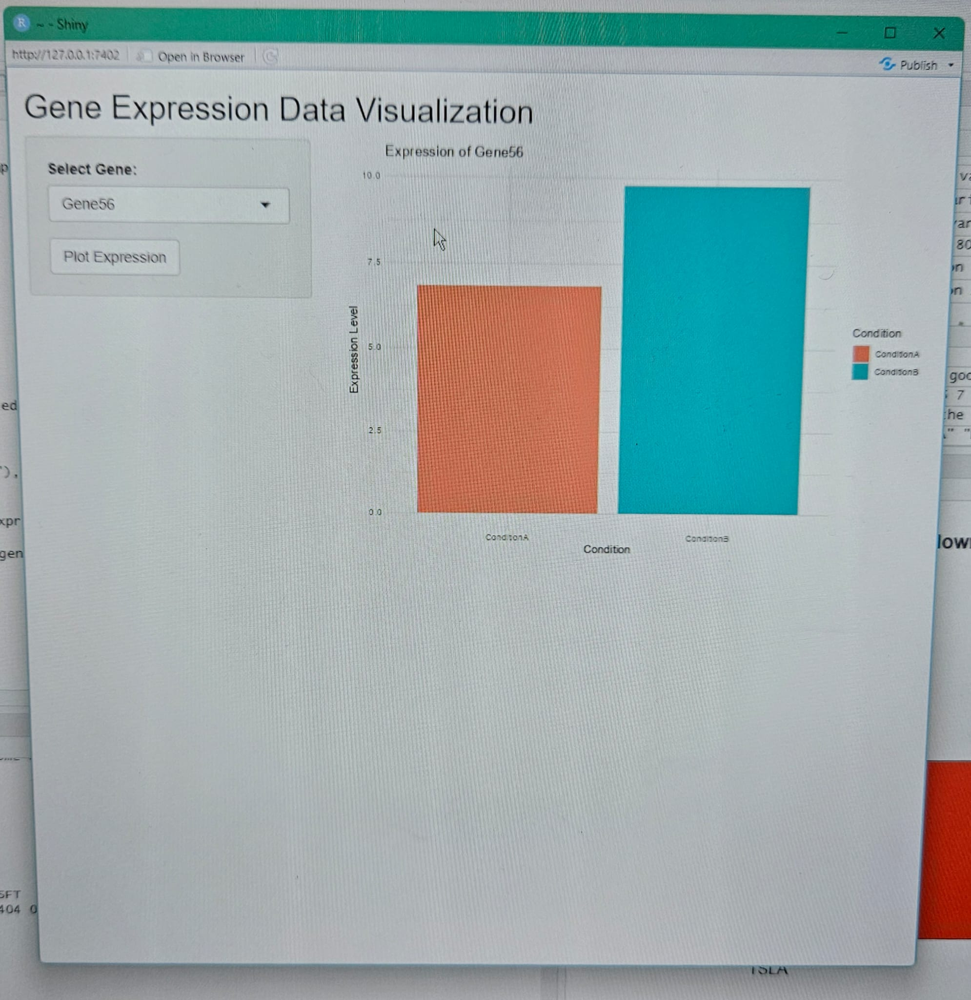

# Gene Expression Data Visualization Shiny App

This project is a Shiny application built in R for visualizing gene expression data under different conditions. The app allows users to select a gene and view its expression levels in two conditions (`ConditionA` and `ConditionB`) through an interactive bar plot. In this project, the conditions, ConditionA and ConditionB, are arbitrary and do not represent any specific experimental conditions; they were chosen to demonstrate and enhance my data visualization skills using R and Shiny.

## Table of Contents

- [Introduction](#introduction)
- [Features](#features)
- [Installation](#installation)
- [Visualizations](#visualizations)
- [Results](#results)

## Introduction

Understanding gene expression under different conditions is crucial in biological research, especially in genetics and molecular biology. This Shiny app allows users to visualize gene expression data in two different conditions (`ConditionA` and `ConditionB`). The application dynamically generates bar plots for each gene, providing an easy-to-understand visualization of gene expression levels.

## Features

- Interactive selection of genes for visualization.
- Dynamic bar plots showing gene expression levels under two conditions.
- Easy-to-use interface with Shiny's reactive programming model.

## Installation

To run this Shiny app, you need to have R and the following R packages installed:

- `shiny`
- `ggplot2`
- `dplyr`
- `tidyverse`

You can install these packages using the following commands in R:

```r
install.packages("shiny")
install.packages("ggplot2")
install.packages("dplyr")
install.packages("tidyverse")
```


## Visualizations

The Shiny app provides an interactive bar plot to visualize the expression levels of selected genes under two different conditions, `ConditionA` and `ConditionB`. The visualizations are generated dynamically based on user input, making it possible to explore the expression levels of 100 different genes.

### Visualization Example: Gene Expression Bar Plot

- **Bar Plot of Gene Expression Levels**:  
  Once a gene is selected from the dropdown menu, the app generates a bar plot that shows its expression levels under `ConditionA` (mean = 10, sd = 2) and `ConditionB` (mean = 12, sd = 2). The plot is created using `ggplot2` in R, and the bars are filled with different colors to distinguish between conditions.

  

  - **X-axis**: Displays the two conditions (`ConditionA` and `ConditionB`).
  - **Y-axis**: Represents the expression level of the selected gene in each condition.
  - **Fill Colors**: Different colors represent different conditions (`ConditionA` and `ConditionB`).

### Dynamic Plotting

The plot dynamically updates based on user interaction. When the "Plot Expression" button is clicked after selecting a gene, a new plot is rendered in real-time, providing a quick and interactive way to visualize and compare gene expression levels.

## Results

The interactive visualizations offer several insights into the gene expression data:

1. **Expression Level Comparison**:  
   The bar plots allow users to easily compare the expression levels of any selected gene between two conditions. This is particularly useful for identifying genes that are significantly up-regulated or down-regulated in `ConditionB` compared to `ConditionA`.

2. **Data Exploration and Analysis**:  
   The interactive nature of the Shiny app enables users to explore the dataset in an engaging manner. Researchers can quickly browse through different genes and observe their expression patterns without manually plotting each one.

3. **Tool for Hypothesis Generation**:  
   The visual differences between `ConditionA` and `ConditionB` provide valuable data that can help researchers formulate hypotheses about gene regulation, expression changes due to environmental factors, or potential biomarkers for certain conditions.

4. **Utility for Researchers**:  
   This tool can be used by researchers to visualize preliminary data before conducting more rigorous statistical analyses. It provides a quick overview of gene expression profiles and highlights any outliers or interesting patterns worth further investigation.
